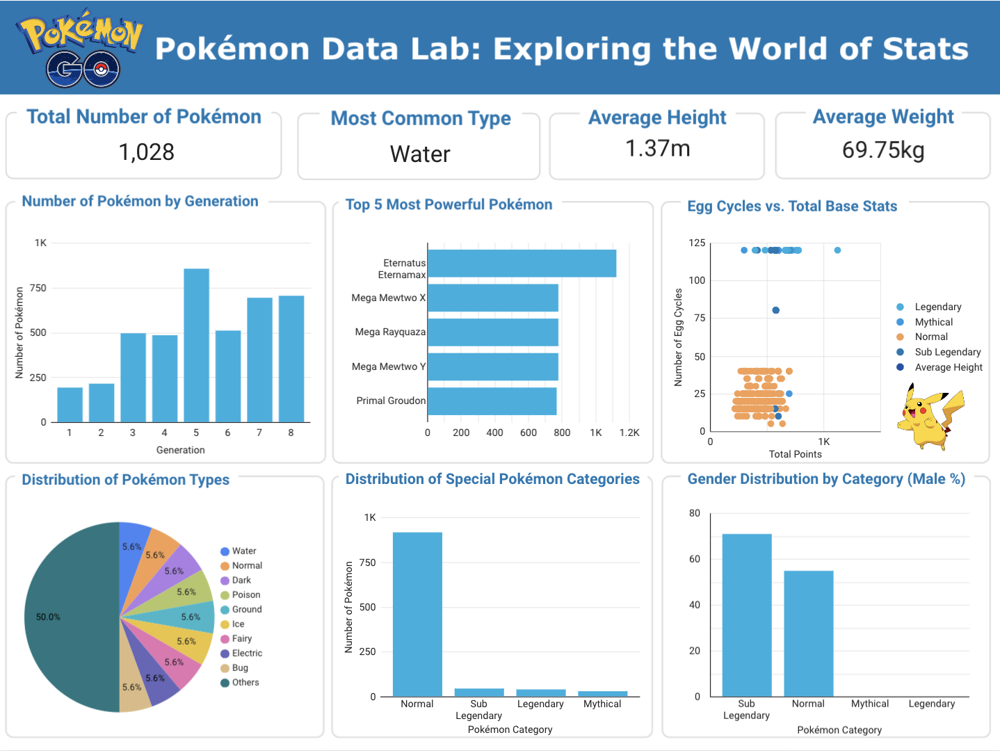

# 🧪 Pokémon Data Lab: Exploring the World of Stats

Welcome to the Pokémon Data Lab, a data visualization project that dives deep into the stats and characteristics of Pokémon across all generations. From base stats to breeding cycles and rarity categories, this interactive dashboard explores the world of Pokémon through data.



---

## 🎯 Project Purpose

The goal of this project is to analyze and visualize a comprehensive Pokémon dataset to uncover meaningful patterns in Pokémon stats, types, breeding behavior, and rarity classifications over time.

Through this project, I aimed to:

- Practice data wrangling and exploratory data analysis (EDA) using a real-world dataset.
- Enhance data storytelling skills through interactive visuals.
- Demonstrate my ability to extract insights and present them clearly for both technical and non-technical audiences.
- Showcase proficiency with Excel and Google Looker Studio.

This project serves as a portfolio piece highlighting my interest and capabilities in data analysis and visualization using a fun and globally recognized dataset.

---

## 📊 Project Overview

This dashboard enables users to:

- Understand the distribution of Pokémon types across generations.
- Observe growth trends in the number of Pokémon over time.
- Analyze the relationship between egg cycles and total base stats.
- Investigate gender distribution and rarity categories (Legendary, Mythical, Sub-legendary, Normal).
- Explore key insights about Pokémon strength, breeding, and traits.

---

## 📈 Data Analysis

The dataset includes detailed information about each Pokémon such as:

- **Types** (primary and secondary)
- **Base stats** (HP, Attack, Defense, Sp. Atk, Sp. Def, Speed, and Total)
- **Breeding** (egg cycles, gender ratio, egg groups)
- **Growth** (catch rate, experience yield, growth rate)
- **Rarity status** (Legendary, Mythical, Sub-legendary)
- **Type weaknesses/resistances**
- **Abilities** and hidden abilities

Data preprocessing and EDA were performed in **Excel**, followed by interactive dashboard creation in **Google Looker Studio**.

---

## 📂 Dataset

The dataset used in this project comes from Kaggle:

> 📊 **Complete Pokémon Dataset**  
> 📥 [Kaggle – mariotormo](https://www.kaggle.com/datasets/mariotormo/complete-pokemon-dataset-updated-090420/data)

It includes all Pokémon from Generations 1 to 8 and covers a wide range of information essential for this analysis.

---

## 🧠 Key Insights

- Water is the most common Pokémon type.
- Generation 5 introduced the most Pokémon.
- Eternatus (Eternamax form) has the highest total base stats.
- Pokémon with longer egg cycles** tend to have higher total base stats.
- Legendary and Mythical Pokémon are genderless, while Sub-legendary Pokémon tend to be ~75% male.
- Normal Pokémon show a more balanced gender distribution (~55% male).
- Special Pokémon categories (Legendary, Mythical, Sub-legendary) are few in number but dominate in terms of power and uniqueness.

---

## 🛠️ Technologies Used

- **Excel** – Data cleaning and transformation  
- **Google Looker Studio** – Interactive dashboard and visualizations  
- **GitHub** – Version control and portfolio presentation  

---

## 📊 Dashboard Description

The dashboard is structured into three main sections:

### 🧾 Overview Cards
- **Total Number of Pokémon**
- **Most Common Type**
- **Average Height (m)**
- **Average Weight (kg)**

### 📊 Section 1 – Stats and Generations
- **Number of Pokémon by Generation** (bar chart)
- **Top 5 Most Powerful Pokémon** (by total base stats)
- **Egg Cycles vs. Total Base Stats** (scatter plot)

### 📊 Section 2 – Category & Gender Insights
- **Type Distribution** (pie or bar chart)
- **Special Pokémon Categories** (Normal, Sub-legendary, Legendary, Mythical)
- **Gender Distribution by Category**

---

## 🚀 How to Use

1. **Open the Dashboard** via the link below.
2. **Scroll** through sections from general stats to deeper insights.
3. **Hover** over charts for specific data points.

> 🔗 [View Live Dashboard](https://lookerstudio.google.com/reporting/2d658e4b-aac9-4de2-a4f8-821f7278ecf3)

---

## 💡 Why This Project

This project was designed not only to explore Pokémon data but also to demonstrate:

- The power of **data storytelling** through visual tools
- Clear and effective **dashboard design**
- Analytical thinking applied to structured datasets
- Strong attention to detail and data interpretation

Pokémon is a fun and familiar theme that makes complex data more engaging and allows for creative exploration.

---

## 📁 Project Structure

```bash
├── report/                  # PDF version of the final report
├── README.md                # Project documentation (this file)
